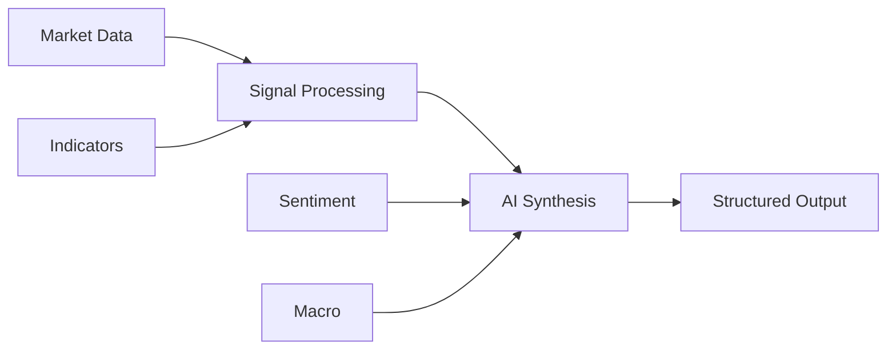

<p align="center">
  
</p>

<p align="center">
  <strong>Behavioral Outlook Zone</strong><br/>
  AI-powered intraday market intelligence
</p>

<p align="center">
  <a href="https://www.typescriptlang.org/">
    
  </a>
  <a href="https://nodejs.org/">
    
  </a>
  <a href="https://opensource.org/licenses/ISC">
    
  </a>
  <a href="https://github.com/AlGhozaliRamadhan">
    
  </a>
</p>

---

## What is BOZ?

**BOZ (Behavioral Outlook Zone)** an AI-driven intraday market analysis engine designed to turn fragmented signals into **clear, structured decision support**.

It combines:

* Technical indicators
* Market structure and price action
* Macro context
* News signals
* Crowd sentiment

…into a single AI-generated output focused on **short-horizon trading insight (2–6 hours)**.

> Current implementation is optimized for **NVDA intraday analysis**, with expansion planned.

---

## Core Principles

* **Signal Fusion** → No single indicator bias
* **Structured Output** → Prediction, confidence, targets
* **Provider Flexibility** → Cloud or local AI
* **Deterministic Pipeline** → Transparent data → AI synthesis
* **Extensible Design** → Built for expansion

---

## Features

* Intraday analysis pipeline (2–6 hour horizon)
* Multi-source signal aggregation
* Technical indicators: SMA, EMA, RSI, MACD, Bollinger Bands, ATR, OBV
* Sentiment integration (Fear & Greed + StockTwits)
* Macro context via benchmark ETFs
* AI provider switching (GitHub Models / Ollama)
* Model fallback chain for resiliency
* Structured AI output:

  * Direction
  * Confidence
  * Target
  * Stop

---

## Architecture Overview



---

## Quick Start

```bash
git clone https://github.com/AlGhozaliRamadhan/boz.git
cd boz
npm install
npm run dev
```

---

## Configuration

Create a `.env` file:

```env
# AI Provider: github (default) or offline
AI_PROVIDER=github

# GitHub Models
GITHUB_TOKEN=ghp_your_token_here
GITHUB_AI_MODEL=openai/gpt-4o-mini
GITHUB_AI_ENDPOINT=https://models.github.ai/inference

# Offline (Ollama-compatible)
OFFLINE_AI_URL=http://localhost:11434
OFFLINE_AI_MODEL=qwen3-14b-t4
```

### Notes

* Defaults to `github` if not specified
* Missing `GITHUB_TOKEN` disables AI in GitHub mode
* Offline mode requires a running Ollama-compatible endpoint
* You can enter offline URL interactively when selecting offline in CLI startup or via `/model offline`
* Interactive offline URL is session-only and is not written to `.env`

---

## CLI Usage

| Command                          | Description                    |
| -------------------------------- | ------------------------------ |
| `/run`                           | Execute intraday NVDA analysis |
| `/model [github\|offline] [url]` | Switch AI provider             |
| `/model github --pick`           | Select model interactively     |
| `/status`                        | Show current configuration     |
| `/help`                          | List commands                  |
| `/exit`                          | Exit session                   |

---

## Scripts

| Command         | Description              |
| --------------- | ------------------------ |
| `npm run dev`   | Run in development (tsx) |
| `npm run build` | Compile TypeScript       |
| `npm run start` | Run compiled output      |
| `npm run test`  | Test placeholder         |

---

## Contributing

Contributions are welcome.

1. Fork the repo
2. Create a feature branch
3. Commit clearly
4. Open a PR with context and impact

---

## Security Notes

* Never commit `.env` or API keys
* Be aware of API rate limits
* Validate all AI-generated outputs before acting

---

## Disclaimer

BOZ is a research and educational tool.
It does not provide financial advice.

All trading decisions are your responsibility.