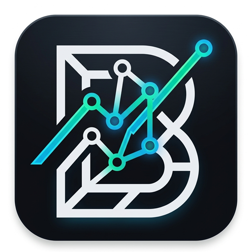
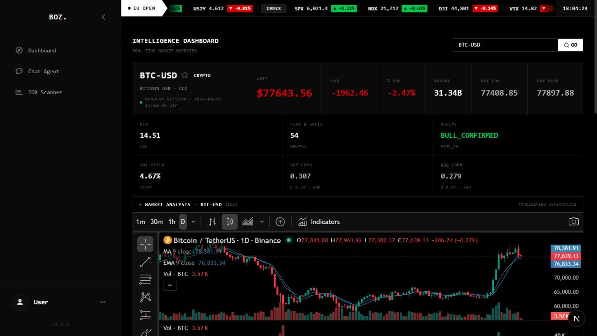
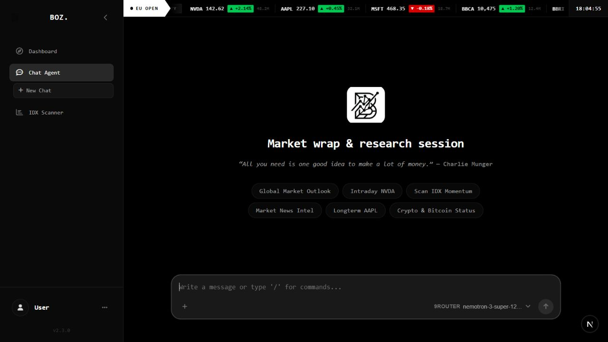
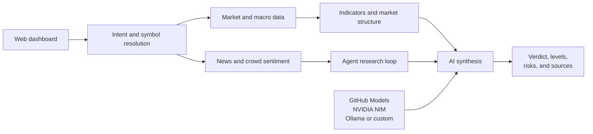

<p align="center">
  
</p>

<h1 align="center">Behavioral Outlook Zone</h1>

<p align="center">
  <strong>AI-assisted market intelligence, from raw data to a risk-aware thesis.</strong>
</p>

<p align="center">
  Analyze stocks, crypto, and IDX-listed companies from one focused web workspace.
</p>

<p align="center">
  <a href="https://www.npmjs.com/package/@agr77/boz"></a>
  <a href="https://www.npmjs.com/package/@agr77/boz"></a>
  
  
  
</p>

<p align="center">
  <a href="#features">Features</a> &bull;
  <a href="#quick-start">Quick start</a> &bull;
  <a href="#configuration">Configuration</a> &bull;
  <a href="#development">Development</a>
</p>

<p align="center">
  
</p>

<p align="center"><sub>Live intelligence dashboard &mdash; quote, macro regime, sentiment, technicals, charting, and trade planning in one view.</sub></p>

## What is BOZ?

BOZ is an open-source market intelligence web app that combines price data, technical indicators, macro context, news, and crowd sentiment. Its job is to turn scattered signals into a structured view: market bias, conviction, entry conditions, targets, stop levels, invalidation criteria, and risks.

Version 2.5 is web-only: install it, run `boz`, and the complete dashboard opens in your browser.

> [!IMPORTANT]
> BOZ is a research and educational tool, not financial advice. Market data can be delayed or incomplete; verify important information independently before acting.

## Features

| Capability | What it gives you |
| --- | --- |
| **Intelligence dashboard** | Quotes, volume, market regime, correlation, sentiment, TradingView charts, and a consolidated verdict. |
| **Multi-timeframe technicals** | RSI, MACD, Bollinger Bands, ATR, OBV, moving averages, Fibonacci levels, and HH/HL or LH/LL structure. |
| **Omni-Agent research** | Conversational analysis with tool use, evidence gathering, reflection, and specialized quantitative, news, and risk perspectives. |
| **Risk-aware trade plans** | Action, conviction, entry, targets, stop loss, reward/risk, invalidation, and late-signal warnings. |
| **News and crowd intelligence** | RSS and market headlines alongside Fear & Greed, StockTwits, Reddit, and crypto community signals. |
| **IDX momentum scanner** | Purpose-built scanning for Indonesian equities and momentum candidates. |
| **Flexible AI backends** | GitHub Models, NVIDIA NIM, an Ollama-compatible local endpoint, or another OpenAI-compatible provider. |
| **Session memory** | Disk-backed preferences and retained context for more consistent follow-up research. |

## Product tour

### Omni-Agent workspace

Start with a suggested workflow or ask BOZ a free-form market question. The agent selects the relevant market, technical, news, sentiment, and risk tools before producing a response.

<p align="center">
  
</p>

### How analysis flows



## Quick start

BOZ requires **Node.js `^22.22.2`, `^24.15.0`, or `>=26.0.0`**.

Run the packaged web app immediately without installing:

```bash
npx @agr77/boz
```

Or install the web launcher globally:

```bash
npm install --global @agr77/boz
boz
```

Running `boz` opens the terminal launcher with the dashboard address, setup status, runtime information, and launch choices. The default address is [http://127.0.0.1:21526](http://127.0.0.1:21526). Choosing **Run in background** starts BOZ without a separate Next.js terminal window.

Background mode uses the native Windows system tray. Double-click the BOZ icon to open the dashboard, or right-click it to open BOZ, choose whether it starts when you sign in, or exit cleanly. `boz web` remains available for scripts and for starting the foreground server directly.

The npm release includes the compiled launcher, Next.js standalone server, static assets, and public assets. Installing from npm does not require cloning the repository or building the app yourself.

### Launcher commands

| Command | Description |
| --- | --- |
| `boz` | Show the terminal launcher and wait for a launch choice. |
| `boz web` | Start the foreground dashboard and open it in your browser. |
| `boz background` | Start the dashboard in the Windows system tray. |
| `boz --port 3001` | Show the launcher using a custom dashboard port. |
| `boz --version` | Print the installed version. |
| `boz --help` | Show command help. |

## Configuration

Configure BOZ from **Settings** in the web interface or with environment variables. Installed settings are stored in `~/.boz/.env`; local development can also use a `.env` file in the project root.

Credentials entered through Settings are write-only: the browser sends a replacement value to BOZ but cannot read saved values back. They are stored in the per-user server configuration file and are never persisted in browser storage. Set `BOZ_CONFIG_DIR` to use a different per-user configuration directory.

```dotenv
# github | nvidia | offline | custom
AI_PROVIDER=github

# GitHub Models
GITHUB_TOKEN=<github-token>
GITHUB_AI_MODEL=openai/gpt-4o
GITHUB_AI_ENDPOINT=https://models.github.ai/inference

# NVIDIA NIM
NVIDIA_API_KEY=<nvidia-api-key>
NVIDIA_AI_MODEL=nvidia/nemotron-3-ultra-550b-a55b
NVIDIA_BASE_URL=https://integrate.api.nvidia.com/v1

# Local Ollama-compatible endpoint
OFFLINE_AI_URL=http://localhost:11434
OFFLINE_AI_MODEL=qwen3-14b-t4

# Any OpenAI-compatible provider (9router, local gateway, and similar)
CUSTOM_AI_URL=http://localhost:20128/v1
CUSTOM_AI_KEY=<optional-api-key>
CUSTOM_AI_MODEL=<model-id>
CUSTOM_AI_MODELS=<model-id>,<another-model-id>

# Optional news and macro enrichment
ALPHA_VANTAGE_API_KEY=<api-key>
FINNHUB_API_KEY=<api-key>
FRED_API_KEY=<api-key>
```

| Provider | Best for | Credential |
| --- | --- | --- |
| **GitHub Models** | Easy hosted setup and broad model choice | `GITHUB_TOKEN` |
| **NVIDIA NIM** | Long, tool-heavy research sessions | `NVIDIA_API_KEY` |
| **Offline / Ollama** | Private local inference | No key by default |
| **Custom** | OpenAI-compatible routers and gateways | Provider-dependent |

Never commit `.env` files or API keys. They are excluded by the repository's `.gitignore`. Remote custom-provider endpoints must use HTTPS; explicit loopback endpoints remain available for local OpenAI-compatible routers.

## Development

```bash
git clone https://github.com/AlGhozaliRamadhan/BOZ.git
cd BOZ
npm ci

# Start the web dashboard
npm run dev:web
```

### Useful scripts

| Script | Purpose |
| --- | --- |
| `npm run dev` | Start the web-only launcher with the Next.js development server. |
| `npm run dev:web` | Run the Next.js dashboard with hot reload. |
| `npm run build:web` | Create the production web build. |
| `npm run build:launcher` | Compile the lightweight `boz` web launcher. |
| `npm run build:package` | Build every artifact included in the npm package. |
| `npm run typecheck` | Type-check the application without emitting files. |
| `npm test` | Run the Vitest test suite once. |
| `npm run test:watch` | Run tests in watch mode. |
| `npm run coverage` | Generate test coverage. |

### Docker

The included Compose setup runs the dashboard on host loopback port `3000`:

```bash
docker compose up --build
```

Then open [http://localhost:3000](http://localhost:3000).

BOZ currently has no multi-user authentication. Keep the service bound to loopback; do not expose the container port to a LAN or the public internet.

## Contributing

Focused pull requests are welcome.

1. Fork the repository and create a feature branch.
2. Make the change and add or update tests where appropriate.
3. Run `npm test` and the relevant build command.
4. Open a pull request describing the behavior change and how it was verified.

## Data and risk notes

- Upstream market and sentiment services can be unavailable, rate-limited, or delayed.
- A high conviction score is model output, not a guarantee of future performance.
- Keep credentials local and review generated analysis before relying on it.
- All trading decisions and resulting gains or losses remain your responsibility.

## License

BOZ is released under the **ISC License**.
