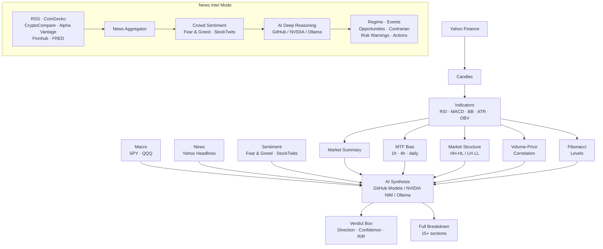

<p align="center">
  
</p>

<p align="center">
  <strong>Behavioral Outlook Zone</strong><br/>
  AI-powered market analysis engine
</p>

<p align="center">
  <a href="https://www.typescriptlang.org/">
    
  </a>
  <a href="https://nodejs.org/">
    
  </a>
  <a href="https://opensource.org/licenses/ISC">
    
  </a>
  <a href="https://github.com/AlGhozaliRamadhan">
    
  </a>
  
</p>

---

## What is BOZ?

**BOZ (Behavioral Outlook Zone)** is an open-source, terminal-native AI market analysis engine. It fuses real-time price data, technical indicators, multi-timeframe confluence, macro context, news, and crowd sentiment into a single AI-generated verdict complete with entry, target, stop, and risk/reward.

Three analysis modes are available and selected at runtime:

| Mode | Horizon | Focus |
|---|---|---|
| **NVDA Intraday** | 2–6 hours | MTF confluence, momentum, volatility |
| **NVDA Long-term** | 3–12 months | SMA structure, 52-week context, trend integrity |
| **News Intel Analyzer** | Cross-asset | Multi-source news aggregation, cross-asset opportunity detection |
| **News Intel Agent** *(Experimental)* | Cross-asset | Autonomous multi-iteration agentic research with tool orchestration |

Three AI providers are supported, selectable interactively at startup or mid-session:

| Provider | Backend | Notes |
|---|---|---|
| **GitHub Models** | OpenAI, DeepSeek, Meta, Microsoft | Free tier available with GitHub token |
| **NVIDIA NIM** | Nemotron, Qwen, GPT-OSS (120B) | Streaming with extended reasoning budget |
| **Ollama (Offline)** | Any Ollama-compatible endpoint | Local, no API key needed |

---


## Output Preview

### NVDA Market Verdict

```
━━━━━━━━━━━━━━━━━━━━━━━━━━━━━━━━━━━━━━━━━━━━━━━━━━━━━━━━━━━━━━━━━━━━━━━━
  [verdict]  LONG  ·  78%  confidence  ·  R/R 1 : 2.14
━━━━━━━━━━━━━━━━━━━━━━━━━━━━━━━━━━━━━━━━━━━━━━━━━━━━━━━━━━━━━━━━━━━━━━━━
  [entry]    $198.34
  [target]   $203.40  (+2.55%)
  [stop]     $196.20  (-1.08%)
  [strategy] Buy breakout above $199, hold to $203 target
━━━━━━━━━━━━━━━━━━━━━━━━━━━━━━━━━━━━━━━━━━━━━━━━━━━━━━━━━━━━━━━━━━━━━━━━
```

Followed by a full breakdown: market snapshot, technical indicators, volatility analysis, chart patterns, Fibonacci levels, MTF confluence, market structure, volume-price correlation, macro context, news, crowd sentiment, and the full AI prediction block.

---

## Signals & Data Sources

### Price Data (Yahoo Finance)
- 1h candles (last 5 days) for intraday
- Daily candles (1 year) + weekly proxy (2 years) for long-term
- Parallel fetch for MTF timeframes

### Technical Indicators
| Indicator | Usage |
|---|---|
| SMA-20 / 50 / 200 | Trend structure, price deviation |
| RSI (14) | Momentum, overbought/oversold zones |
| MACD (12/26/9) | Momentum crossover, histogram delta |
| Bollinger Bands (20, 2σ) | Squeeze detection, price position |
| ATR (14) | Volatility, stop sizing |
| OBV | Accumulation vs distribution |
| Volume SMA (20) | Volume ratio vs average |

### Multi-Timeframe Confluence (Intraday)
MACD cross, RSI > 50, and SMA-20 price position evaluated independently across 1h, 4h, and daily combined into a single alignment signal with confidence score.

### Market Structure (Intraday)
Peak and trough detection on the last 24 candles to identify Higher Highs / Higher Lows (uptrend) or Lower Highs / Lower Lows (downtrend).

### Volume-Price Correlation (Intraday)
Average volume on up-moves vs down-moves over the last 20 candles. Ratio above 1.15× signals accumulation; below 0.85× signals distribution.

### Macro Context
SPY and QQQ 5-day directional change. Classifies market regime as RISK_ON, RISK_OFF, or NEUTRAL.

### Crowd Sentiment
- **Fear & Greed** alternative.me, 7-day window with trend momentum (RISING_GREED / RISING_FEAR / STABLE)
- **StockTwits NVDA** real-time bull/bear message ratio
- **CoinGecko community** top 10 coin price direction used as cross-asset mood

### News Intel Sources
- CoinGecko trending coins
- CryptoCompare news feed (impact-scored)
- Alpha Vantage stock news + sentiment scores *(requires `ALPHA_VANTAGE_API_KEY`)*
- Finnhub general market news *(requires `FINNHUB_API_KEY`)*
- FRED economic releases *(requires `FRED_API_KEY`)*
- RSS feeds: Yahoo Finance, MarketWatch, CNBC, Investing.com, Kitco, OilPrice, FXStreet
- StockTwits trending symbols
- Fear & Greed Index (alternative.me, 7-day)

### AI Synthesis
Structured prompt sent to the configured model. Full reasoning context provided. NVDA analysis output is parsed for PREDICTION, CONFIDENCE, STRATEGY, TARGET, and STOP. News Intel output is parsed for regime, events, opportunities, contrarian signals, and risk warnings. Falls back through a model chain on rate limit or timeout (GitHub provider).

---

## Architecture



---

## Install

```bash
git clone https://github.com/AlGhozaliRamadhan/boz.git
cd boz
npm install
npm run dev
```

At startup, select your AI provider and model. Then type `/run` to begin.

---

## Configuration

Create a `.env` file in the project root:

```env
# AI Provider: github (default), nvidia, or offline
AI_PROVIDER=github

# GitHub Models
GITHUB_TOKEN=ghp_your_token_here
GITHUB_AI_MODEL=openai/gpt-4o
GITHUB_AI_ENDPOINT=https://models.github.ai/inference

# NVIDIA NIM
NVIDIA_API_KEY=nvapi-your_key_here
NVIDIA_AI_MODEL=nvidia/nemotron-3-super-120b-a12b
NVIDIA_BASE_URL=https://integrate.api.nvidia.com/v1

# Offline (Ollama-compatible)
OFFLINE_AI_URL=http://localhost:11434
OFFLINE_AI_MODEL=qwen3-14b-t4

# News Intel optional enrichment
ALPHA_VANTAGE_API_KEY=your_key_here
FINNHUB_API_KEY=your_key_here
FRED_API_KEY=your_key_here
```

**Provider notes:**
- Defaults to `github` if `AI_PROVIDER` is not set
- If `AI_PROVIDER` is set in `.env`, the startup wizard skips the interactive picker and applies it directly
- Missing `GITHUB_TOKEN` triggers an interactive setup flow that opens the GitHub token page in your browser and saves the token to `.env`
- Missing `NVIDIA_API_KEY` triggers the same flow pointing to build.nvidia.com
- Offline URL can be entered interactively at startup or via `/model offline <url>` — it is session-only and never written to `.env`

---

## CLI Reference

| Command | Description |
|---|---|
| `/run` | Pick analysis mode (NVDA Market or News Intel) and execute |
| `/model` | Show current provider, model, and endpoint |
| `/model github` | Switch to GitHub Models provider |
| `/model github --pick` | Select GitHub model interactively |
| `/model nvidia` | Switch to NVIDIA NIM and pick model interactively |
| `/model offline <url>` | Switch to Ollama-compatible endpoint (session only) |
| `/status` | Show current provider, model, and endpoint |
| `/version` | Show Boz version |
| `/help` | List all commands |
| `/exit` | Exit Boz |

Tab autocompletes all commands. Left/right arrows navigate the mode picker on `/run`. Up/down arrows navigate model pickers.

---

## Scripts

| Command | Description |
|---|---|
| `npm run dev` | Run in development mode (tsx, no compile step) |
| `npm run build` | Compile TypeScript to `dist/` and run `npm link` |
| `npm run start` | Run compiled output from `dist/` |
| `npm run ping` | Run the provider ping utility |

---

## Contributing

Contributions are welcome.

1. Fork the repo
2. Create a feature branch (`git checkout -b feature/your-feature`)
3. Commit with clear messages
4. Open a PR describing what changed and why

Please keep PRs focused.

---

## Security Notes

- Never commit `.env` or any file containing API keys
- The `.gitignore` already excludes `.env` verify before pushing
- Be mindful of API rate limits on GitHub Models and NVIDIA NIM free tiers
- Offline URL entered interactively is session-only and is never written to `.env`
- All AI outputs are advisory validate before acting on them

---

## Disclaimer

BOZ is a research and educational tool. It does not constitute financial advice.
All trading decisions are your sole responsibility.
Past analysis results do not guarantee future accuracy.
