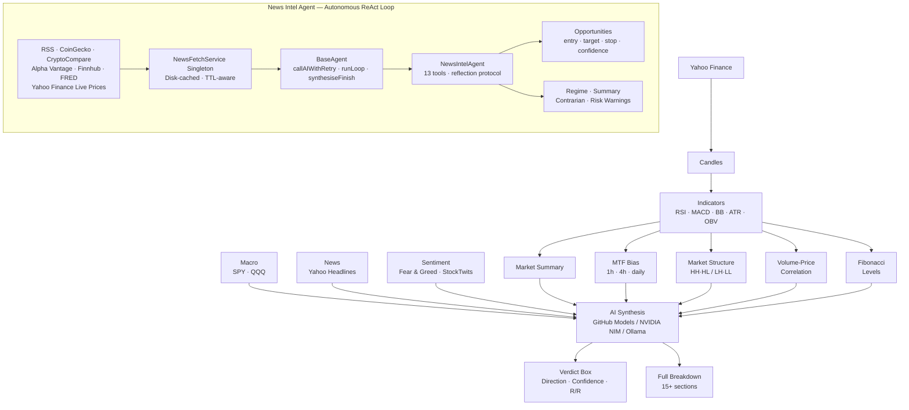

<p align="center">
  
</p>

<p align="center">
  <strong>Behavioral Outlook Zone</strong><br/>
  AI-powered market analysis engine
</p>

<p align="center">
  <a href="https://www.typescriptlang.org/">
    
  </a>
  <a href="https://nodejs.org/">
    
  </a>
  <a href="https://opensource.org/licenses/ISC">
    
  </a>
  <a href="https://github.com/AlGhozaliRamadhan">
    
  </a>
  
</p>

---

## What is BOZ?

**BOZ (Behavioral Outlook Zone) v2.3** is an open-source, full-stack AI market analysis dashboard. It fuses real-time price data, technical indicators, multi-timeframe confluence, macro context, news, and crowd sentiment into structured, actionable intelligence complete with entry, target, stop, and risk/reward.

Analysis is now fully consolidated into a sleek, unified text-based Omni-Agent Chat interface. The UI relies entirely on natural conversational prompts and slash commands:

| Feature | Description |
|---|---|
| **Unified Omni-Agent** | The core borderless interface for BOZ. All analysis runs through a single immersive chat terminal without clunky cards. |
| **Intraday Commands** | Use `/intraday [ticker]` for 2-6 hour momentum, volatility, and MTF confluence analysis returned in crisp markdown. |
| **Long-term Commands** | Use `/longterm [ticker]` for 3-12 month SMA structure and 52-week context. |
| **News Intel** | Use `/newsintel` for cross-asset multi-source news aggregation and crowd sentiment scoring. |

Three AI providers are supported, configurable via the Settings page or `.env`:

| Provider | Backend | Notes |
|---|---|---|
| **GitHub Models** | OpenAI, DeepSeek, Meta, Microsoft | Free tier with GitHub token. Best for light analysis. |
| **NVIDIA NIM** | Nemotron 120B, DeepSeek V4, Qwen3.5, GPT-OSS 120B | Recommended for the News Intel Agent larger context, higher rate limits |
| **Ollama (Offline)** | Any Ollama-compatible endpoint | Local, no API key needed |

---

### Reflection Protocol

After every tool result, the agent reflects using a structured four-part format before deciding what to do next:

```
RECEIVED: what the data actually showed
EXPECTED: was this anticipated, and why
CHANGES:  how this updates the current thesis
NEXT:     what specific question this raises
```

### Opportunity Emission Standards

Every emitted opportunity must include a **Conviction Level**:
- **HIGH**: 3+ independent signals align. Action allowed: BUY / SELL.
- **MEDIUM**: 2 signals align. Action allowed: BUY / SELL.
- **SPECULATIVE**: Technical + macro align but confirmation missing (e.g. waiting on a catalyst). Confidence 40-55. WATCH preferred, but still emitted for transparency.

| Confidence | Requirement | Action allowed |
|---|---|---|
| > 80% | 3 independent confirming signals + Live price fetched | BUY / SELL |
| 65–80% | 2 signals | BUY / SELL |
| 50–65% | 1 signal | WATCH only |
| < 50% | — | Skip |

Every emitted opportunity includes: asset, asset type, action, conviction, confidence, reasoning, entry range, target range, stop loss, invalidation condition, risks, late-signal flag, and **exact tool sources**.
Hard enforcement: `emit_opportunities` is blocked unless `scan_upcoming_catalysts`, `fetch_news`, `fetch_fear_greed`, `fetch_price`, and `fetch_price_momentum` were run and cited in `sources`.

### Session Memory & Retrospective

The agent now remembers its past sessions. At the start of a new run, it reads the previous `session.log.json` and loads a **Retrospective Context**. Before making new calls, it checks its past calls (e.g. "BUY BTC @ 85% conviction"), fetches the live price, and scores itself ("AGED WELL" or "MISS") to continually calibrate its confidence. 

Additionally, the **Interactive Chat Agent** utilizes a local disk-backed **MemoryService**. It can autonomously extract and permanently store your trading preferences, risk tolerance, and portfolio rules across sessions, injecting them into its context at startup.

### Sub-Agent Delegation

To handle extremely complex multi-step reasoning, the main BOZ agent can concurrently delegate tasks to highly specialized sub-agents:
- 🧮 **QuantBrain**: Ignores sentiment and focuses strictly on technical indicators, math, and risk-reward ratios.
- 🐶 **NewsHound**: Specializes in reading macro-economic events and crowd sentiment.
- 🛡️ **RiskManager**: Acts as a strict devil's advocate whose sole job is to identify flaws, traps, and red flags in any setup.

Sub-agents are injected with the full conversation history and the verified data ledger before beginning their analysis, ensuring they have perfect context without blind spots.

### Resilience

- **Retry on 429 / 5xx:** every AI call is wrapped in `callAIWithRetry` up to 3 attempts with linear backoff (5 s → 10 s → 15 s). Retries also cover network-level errors (`ECONNRESET`, `ETIMEDOUT`).
- **News + sentiment backoff:** external news and crowd sentiment fetches retry on 429/5xx with exponential backoff and jitter to reduce rate-limit failures.
- **Data freshness visibility:** intraday and long-term outputs show latest candle time, age, stale threshold, and incomplete-candle flags (Yahoo data may be delayed).
- **Partial state on crash:** if the loop exits due to an unrecoverable error, `synthesiseFinish()` runs automatically so whatever the agent had accumulated is always rendered never a blank output.
- **Soft nudge:** at 15 minutes the agent is asked to wrap up. Hard cap is 20 minutes / 80 iterations.
- **Meta-summary fallback:** if the post-session AI debrief call fails, the inline `marketSummary`, `riskWarnings`, and `contrarian` signals are rendered instead.

---

## Architecture



---

## Install

Global install (requires Node 18+):

```bash
npm install -g boz
```

Then run from anywhere:

```bash
boz                 # choose Terminal or Web UI
boz terminal        # open the terminal CLI
boz web             # start the dashboard and open the browser
boz web --port 3001 # use a different port
boz --version
```

Settings and API keys are stored per-user in `~/.boz/.env`.

> **Recommendation:** Use **NVIDIA NIM** for the News Intel Agent. GitHub Models has aggressive rate limits that can interrupt multi-step agentic sessions. NVIDIA NIM handles the longer context window and sustained tool-calling loop without throttling.

---

## Configuration

Create a `.env` file in the project root:

```env
# AI Provider: github (default), nvidia, or offline
AI_PROVIDER=nvidia

# GitHub Models
GITHUB_TOKEN=ghp_your_token_here
GITHUB_AI_MODEL=openai/gpt-4o
GITHUB_AI_ENDPOINT=https://models.github.ai/inference

# NVIDIA NIM (recommended for News Intel Agent)
NVIDIA_API_KEY=nvapi-your_key_here
NVIDIA_AI_MODEL=nvidia/nemotron-3-super-120b-a12b
NVIDIA_BASE_URL=https://integrate.api.nvidia.com/v1

# Offline (Ollama-compatible)
OFFLINE_AI_URL=http://localhost:11434
OFFLINE_AI_MODEL=qwen3-14b-t4

# News Intel optional enrichment
ALPHA_VANTAGE_API_KEY=your_key_here
FINNHUB_API_KEY=your_key_here
FRED_API_KEY=your_key_here
```

**Provider notes:**
- Defaults to `github` if `AI_PROVIDER` is not set
- The active AI provider can also be switched seamlessly from the **Settings** page in the dashboard.


---

## Scripts (Local Development)

| Command | Description |
|---|---|
| `npm run dev` | Start the Next.js dev server with hot-reloading |
| `npm run build` | Build the optimized standalone Next.js production app |
| `npm run start` | Start the Next.js production server |
| `npm test` | Run test suite (Vitest) |
| `npm run coverage` | Run tests with coverage report |

---

## Contributing

Contributions are welcome.

1. Fork the repo
2. Create a feature branch (`git checkout -b feature/your-feature`)
3. Commit with clear messages
4. Open a PR describing what changed and why

Please keep PRs focused. See `docs/` for per-version changelogs.

---

## Security Notes

- Never commit `.env` or any file containing API keys
- The `.gitignore` already excludes `.env` verify before pushing
- Be mindful of API rate limits on GitHub Models and NVIDIA NIM free tiers the News Intel Agent makes sustained multi-step calls
- Offline URL entered interactively is session-only and is never written to `.env`
- All AI outputs are advisory validate before acting on them

---

## Disclaimer

BOZ is a research and educational tool. It does not constitute financial advice.
All trading decisions are your sole responsibility.
Past analysis results do not guarantee future accuracy.
