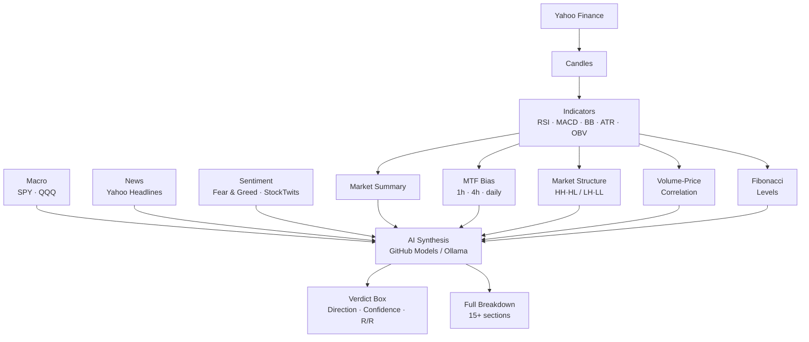

<p align="center">
  
</p>

<p align="center">
  <strong>Behavioral Outlook Zone</strong><br/>
  AI-powered market analysis engine — intraday and long-term
</p>

<p align="center">
  <a href="https://www.typescriptlang.org/">
    
  </a>
  <a href="https://nodejs.org/">
    
  </a>
  <a href="https://opensource.org/licenses/ISC">
    
  </a>
  <a href="https://github.com/AlGhozaliRamadhan">
    
  </a>
  
</p>

---

## What is BOZ?

**BOZ (Behavioral Outlook Zone)** is an open-source, terminal-native AI market analysis engine built for NVDA. It fuses real-time price data, technical indicators, multi-timeframe confluence, macro context, news, and crowd sentiment into a single AI-generated verdict complete with entry, target, stop, and risk/reward.

Two analysis modes are available and selected at runtime:

| Mode | Horizon | Bars | Focus |
|---|---|---|---|
| **Intraday** | 2–6 hours | 1h (5 days) + 4h + daily | MTF confluence, momentum, volatility |
| **Long-term** | 3–12 months | Daily (1yr) + weekly (2yr) | SMA structure, 52-week context, trend integrity |

---

## How It Works

Every run follows a deterministic pipeline before handing off to AI:

```
Yahoo Finance
  └─ Price candles (1h / daily / weekly)
       └─ Indicators (RSI · MACD · BB · ATR · OBV · SMA)
            └─ Market Summary + Pattern Detection
                 └─ Multi-Timeframe Bias (1h · 4h · daily)
                      └─ Macro Context (SPY · QQQ)
                           └─ News Headlines
                                └─ Crowd Sentiment (Fear & Greed · StockTwits)
                                     └─ AI Synthesis (GitHub Models / Ollama)
                                          └─ Verdict Box + Full Breakdown
```

The AI receives fully structured, labeled data not raw candles. It returns a direction, confidence score, strategy, 12-month or session target, and stop level. The verdict box is printed at the top of the output so you see the result immediately.

---

## Output Preview

```
━━━━━━━━━━━━━━━━━━━━━━━━━━━━━━━━━━━━━━━━━━━━━━━━━━━━━━━━━━━━━━━━━━━━━━━━
  [verdict]  LONG  ·  78%  confidence  ·  R/R 1 : 2.14
━━━━━━━━━━━━━━━━━━━━━━━━━━━━━━━━━━━━━━━━━━━━━━━━━━━━━━━━━━━━━━━━━━━━━━━━
  [entry]    $198.34
  [target]   $203.40  (+2.55%)
  [stop]     $196.20  (-1.08%)
  [strategy] Buy breakout above $199, hold to $203 target
━━━━━━━━━━━━━━━━━━━━━━━━━━━━━━━━━━━━━━━━━━━━━━━━━━━━━━━━━━━━━━━━━━━━━━━━
```

Followed by a full breakdown: market snapshot, technical indicators, volatility
analysis, chart patterns, Fibonacci levels, MTF confluence, market structure,
volume-price correlation, macro context, news, crowd sentiment, and the full
AI prediction block.

---

## Core Principles

**Signal Fusion** 
No single indicator drives the call. RSI, MACD, BB, ATR, OBV, volume, structure, sentiment, and macro all feed the AI together.

**Verdict First** 
The result is shown at the top of output, before the detail sections. You never have to scroll to find the answer.

**Data-Driven Output**
Every row in the terminal output is wired to a real computed value. Nothing is hardcoded or stubbed.

**Provider Flexibility** 
Switch between GitHub Models (cloud) and any Ollama-compatible endpoint (local) at startup or mid-session.

**Transparent Pipeline** 
The full prompt context sent to AI is logged. Every section of output maps to a real data source.

---

## Signals & Data Sources

### Price Data Yahoo Finance
- 1h candles (last 5 days) for intraday
- Daily candles (1 year) + weekly proxy (2 years) for long-term
- Parallel fetch for MTF timeframes

### Technical Indicators
| Indicator | Usage |
|---|---|
| SMA-20 / 50 / 200 | Trend structure, price deviation |
| RSI (14) | Momentum, overbought/oversold zones |
| MACD (12/26/9) | Momentum crossover, histogram delta |
| Bollinger Bands (20, 2σ) | Squeeze detection, price position |
| ATR (14) | Volatility, stop sizing |
| OBV | Accumulation vs distribution |
| Volume SMA (20) | Volume ratio vs average |

### Multi-Timeframe Confluence (Intraday)
MACD cross, RSI > 50, and SMA-20 price position evaluated independently across 1h, 4h, and daily combined into a single alignment signal with confidence score.

### Market Structure (Intraday)
Peak and trough detection on the last 24 candles to identify Higher Highs / Higher Lows (uptrend) or Lower Highs / Lower Lows (downtrend).

### Volume-Price Correlation (Intraday)
Average volume on up-moves vs down-moves over the last 20 candles. Ratio above 1.15× signals accumulation; below 0.85× signals distribution.

### Macro Context
SPY and QQQ 5-day directional change. Classifies market regime as RISK_ON, RISK_OFF, or NEUTRAL.

### Crowd Sentiment
- **Fear & Greed** CNN Money primary, alternative.me fallback. Inline progress bar in output.
- **StockTwits NVDA** Real-time bull/bear message ratio.

### AI Synthesis
Structured prompt sent to the configured model. Full reasoning context provided. Output parsed for PREDICTION, CONFIDENCE, STRATEGY, TARGET, and STOP. Falls back through a model chain on rate limit or timeout.

---

## Architecture



---

## Quick Start

```bash
git clone https://github.com/AlGhozaliRamadhan/boz.git
cd boz
npm install
npm run dev
```

At startup, select your AI provider and model. Then type `/run` to begin.

---

## Configuration

Create a `.env` file in the project root:

```env
# AI Provider: github (default) or offline
AI_PROVIDER=github

# GitHub Models
GITHUB_TOKEN=ghp_your_token_here
GITHUB_AI_MODEL=openai/gpt-4o
GITHUB_AI_ENDPOINT=https://models.github.ai/inference

# Offline (Ollama-compatible)
OFFLINE_AI_URL=http://localhost:11434
OFFLINE_AI_MODEL=qwen3:14b
```

**Provider notes:**
- Defaults to `github` if `AI_PROVIDER` is not set
- Missing `GITHUB_TOKEN` disables AI calls in GitHub mode
- Offline mode requires a running Ollama-compatible server
- Offline URL can be entered interactively at startup or via `/model offline <url>`
- Interactive offline URL is session-only and never written to `.env`

**Supported GitHub Models** (selectable interactively with `/model github --pick`):
- `openai/gpt-4o` — recommended
- `openai/gpt-4o-mini` — fast, generous quota
- `openai/gpt-5` — most capable
- `deepseek/DeepSeek-R1-0528` — reasoning model
- `deepseek/DeepSeek-V3-0324` — fast, balanced
- `meta/Llama-4-Scout-17B-16E-Instruct`
- `microsoft/Phi-4`

---

## CLI Reference

| Command | Description |
|---|---|
| `/run` | Pick analysis mode (Intraday or Long-term) and execute |
| `/model github` | Switch to GitHub Models provider |
| `/model github --pick` | Select model interactively |
| `/model offline <url>` | Switch to Ollama-compatible endpoint |
| `/status` | Show current provider, model, and endpoint |
| `/help` | List all commands |
| `/exit` | Exit Boz |

Tab autocompletes all commands. Left/right arrows navigate the mode picker on `/run`.

---

## Scripts

| Command | Description |
|---|---|
| `npm run dev` | Run in development mode (tsx, no compile step) |
| `npm run build` | Compile TypeScript to `dist/` |
| `npm run start` | Run compiled output from `dist/` |

---

## Contributing

Contributions are welcome.

1. Fork the repo
2. Create a feature branch (`git checkout -b feature/your-feature`)
3. Commit with clear messages
4. Open a PR describing what changed and why

Please keep PRs focused — one concern per PR.

---

## Security Notes

- Never commit `.env` or any file containing API keys
- The `.gitignore` already excludes `.env` verify before pushing
- Be mindful of API rate limits on GitHub Models free tier
- All AI outputs are advisory validate before acting on them

---

## Roadmap

- [ ] Multi-ticker support (generalize from NVDA-only)
- [ ] Quiet mode (`--quiet`) — print verdict box only and exit
- [ ] Separate engine from terminal UI for programmatic use
- [ ] Test coverage — sentiment parsing, AI response parsing, stale-data handling
- [ ] Export analysis to JSON or Markdown file

---

## Disclaimer

BOZ is a research and educational tool. It does not constitute financial advice.
All trading decisions are your sole responsibility.
Past analysis results do not guarantee future accuracy.
