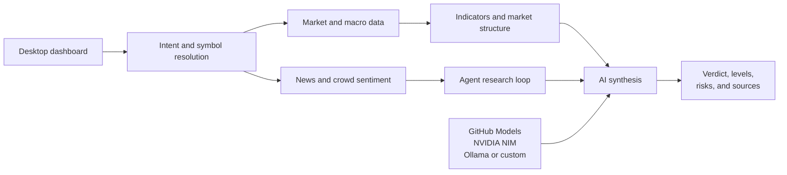

<p align="center">
  
</p>

<h1 align="center">Behavioral Outlook Zone</h1>

<p align="center">
  <strong>AI-assisted market intelligence, from raw data to a risk-aware thesis.</strong>
</p>

<p align="center">
  Analyze stocks, crypto, and IDX-listed companies from one focused desktop workspace.
</p>

<p align="center">
  
  
  
  
</p>

<p align="center">
  <a href="#features">Features</a> &bull;
  <a href="#quick-start">Quick start</a> &bull;
  <a href="#configuration">Configuration</a> &bull;
  <a href="#development">Development</a>
</p>

<p align="center">
  
</p>

<p align="center"><sub>Live intelligence dashboard &mdash; quote, macro regime, sentiment, technicals, charting, and trade planning in one view.</sub></p>

## What is BOZ?

BOZ is an open-source Windows desktop market intelligence app that combines price data, technical indicators, macro context, news, and crowd sentiment. Its job is to turn scattered signals into a structured view: market bias, conviction, entry conditions, targets, stop levels, invalidation criteria, and risks.

The desktop host uses Tauri and the Windows WebView2 runtime. BOZ bundles a native Node.js 24.15.0 sidecar for its Next.js API and streaming features, so users do not need to install Node.js.

> [!IMPORTANT]
> BOZ is a research and educational tool, not financial advice. Market data can be delayed or incomplete; verify important information independently before acting.

## Features

| Capability | What it gives you |
| --- | --- |
| **Intelligence dashboard** | Quotes, volume, market regime, correlation, sentiment, TradingView charts, and a consolidated verdict. |
| **Multi-timeframe technicals** | RSI, MACD, Bollinger Bands, ATR, OBV, moving averages, Fibonacci levels, and HH/HL or LH/LL structure. |
| **Omni-Agent research** | Conversational analysis with tool use, evidence gathering, reflection, and specialized quantitative, news, and risk perspectives. |
| **Risk-aware trade plans** | Action, conviction, entry, targets, stop loss, reward/risk, invalidation, and late-signal warnings. |
| **News and crowd intelligence** | RSS and market headlines alongside Fear & Greed, StockTwits, Reddit, and crypto community signals. |
| **IDX screeners and Expert Signal** | Momentum, breakout, rebound, oversold, downtrend, and 52-week-low screens with explainable technical confluence and risk-defined plans. |
| **Flexible AI backends** | OpenAI, Anthropic, Groq, OpenRouter, GitHub Models, NVIDIA NIM, Ollama, and OpenAI-compatible local gateways. |
| **Session memory** | Disk-backed preferences and retained context for more consistent follow-up research. |

## Product tour

### Omni-Agent workspace

Start with a suggested workflow or ask BOZ a free-form market question. The agent selects the relevant market, technical, news, sentiment, and risk tools before producing a response.

<p align="center">
  
</p>

### How analysis flows



## Quick start

Download the installer for your Windows 11 computer from the [latest GitHub Release](https://github.com/AlGhozaliRamadhan/BOZ/releases/latest):

- `boz-v<VERSION>-windows-x64-setup.exe` for Intel and AMD PCs.
- `boz-v<VERSION>-windows-arm64-setup.exe` for ARM64 PCs.

The per-user installer does not require administrator privileges. Early beta installers are not Authenticode-signed, so Windows SmartScreen may display an **Unknown publisher** warning. BOZ application updates are still cryptographically signed and are rejected if they are modified.

Closing the window keeps BOZ running in the system tray. The tray menu can reopen BOZ, check for signed updates, opt in to **Start with Windows**, or quit completely. Autostart is disabled by default and starts BOZ hidden when enabled.

Linux packages are not produced yet. The desktop supervision code uses platform-neutral paths and process boundaries so AppImage/deb support can be added later.

## Configuration

Configure BOZ from **Settings** in the desktop interface. Desktop settings use Tauri's per-user application configuration directory (normally `%APPDATA%\com.agr77.boz`); local web development can also use a `.env` file in the project root.

Credentials entered through Settings are write-only: the WebView sends a replacement value to BOZ but cannot read saved values back. They are stored in the desktop profile and are never persisted in browser storage. Existing `~/.boz` or browser data is neither imported nor deleted.

```dotenv
# openai | anthropic | groq | openrouter | github | nvidia | offline | custom
AI_PROVIDER=github

# OpenAI
OPENAI_API_KEY=<openai-api-key>
OPENAI_AI_MODEL=gpt-6-astra

# Anthropic
ANTHROPIC_API_KEY=<anthropic-api-key>
ANTHROPIC_AI_MODEL=claude-opus-5

# Groq
GROQ_API_KEY=<groq-api-key>
GROQ_AI_MODEL=openai/gpt-oss-120b

# OpenRouter
OPENROUTER_API_KEY=<openrouter-api-key>
OPENROUTER_AI_MODEL=~openai/gpt-latest

# GitHub Models
GITHUB_TOKEN=<github-token>
GITHUB_AI_MODEL=openai/gpt-4o
GITHUB_AI_ENDPOINT=https://models.github.ai/inference

# NVIDIA NIM
NVIDIA_API_KEY=<nvidia-api-key>
NVIDIA_AI_MODEL=nvidia/nemotron-3-ultra-550b-a55b
NVIDIA_BASE_URL=https://integrate.api.nvidia.com/v1

# Local Ollama-compatible endpoint
OFFLINE_AI_URL=http://localhost:11434
OFFLINE_AI_MODEL=qwen3-14b-t4

# Any OpenAI-compatible provider (9router, local gateway, and similar)
CUSTOM_AI_URL=http://localhost:20128/v1
CUSTOM_AI_KEY=<optional-api-key>
CUSTOM_AI_MODEL=<model-id>
CUSTOM_AI_MODELS=<model-id>,<another-model-id>

# Optional news and macro enrichment
ALPHA_VANTAGE_API_KEY=<api-key>
FINNHUB_API_KEY=<api-key>
FRED_API_KEY=<api-key>
```

| Provider | Best for | Credential |
| --- | --- | --- |
| **GitHub Models** | Easy hosted setup and broad model choice | `GITHUB_TOKEN` |
| **NVIDIA NIM** | Long, tool-heavy research sessions | `NVIDIA_API_KEY` |
| **OpenAI** | Official GPT models | `OPENAI_API_KEY` |
| **Anthropic** | Official Claude models | `ANTHROPIC_API_KEY` |
| **Groq** | High-speed open-model inference | `GROQ_API_KEY` |
| **OpenRouter** | Multi-provider routing and model catalog | `OPENROUTER_API_KEY` |
| **Offline / Ollama** | Private local inference | No key by default |
| **Custom** | OpenAI-compatible routers and gateways | Provider-dependent |

Never commit `.env` files or API keys. They are excluded by the repository's `.gitignore`. Remote custom-provider endpoints must use HTTPS; explicit loopback endpoints remain available for local OpenAI-compatible routers.

## Development

```bash
git clone https://github.com/AlGhozaliRamadhan/BOZ.git
cd BOZ
npm ci

# Start the Tauri desktop app and Next.js development server
npm run dev
```

Desktop development requires Node.js 24.15.0 for release-equivalent packaging, the stable Rust toolchain, Microsoft C++ Build Tools, and WebView2. `npm run dev:web` remains available for browser-only frontend work.

### Useful scripts

| Script | Purpose |
| --- | --- |
| `npm run dev` | Start Tauri with the Next.js development server. |
| `npm run dev:web` | Run the browser-only Next.js dashboard on `127.0.0.1:21526`. |
| `npm run build:web` | Create the production web build. |
| `npm run prepare:desktop` | Build and sanitize the standalone server, then bundle the pinned Node runtime. |
| `npm run build:package` | Build the per-user NSIS desktop installer and updater signature. |
| `npm run typecheck` | Type-check the application without emitting files. |
| `npm test` | Run the Vitest test suite once. |
| `npm run test:watch` | Run tests in watch mode. |
| `npm run coverage` | Generate test coverage. |

### Docker

The included Compose setup runs the dashboard on host loopback port `3000`:

```bash
docker compose up --build
```

Then open [http://localhost:3000](http://localhost:3000).

BOZ currently has no multi-user authentication. Keep the service bound to loopback; do not expose the container port to a LAN or the public internet.

## Contributing

Focused pull requests are welcome.

1. Fork the repository and create a feature branch.
2. Make the change and add or update tests where appropriate.
3. Run `npm test` and the relevant build command.
4. Open a pull request describing the behavior change and how it was verified.

## Data and risk notes

- Upstream market and sentiment services can be unavailable, rate-limited, or delayed.
- A high conviction score is model output, not a guarantee of future performance.
- Keep credentials local and review generated analysis before relying on it.
- All trading decisions and resulting gains or losses remain your responsibility.

## License

BOZ is released under the **ISC License**.
