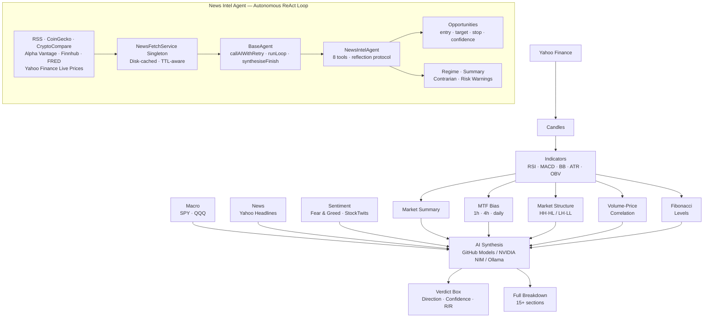

<p align="center">
  
</p>

<p align="center">
  <strong>Behavioral Outlook Zone</strong><br/>
  AI-powered market analysis engine
</p>

<p align="center">
  <a href="https://www.typescriptlang.org/">
    
  </a>
  <a href="https://nodejs.org/">
    
  </a>
  <a href="https://opensource.org/licenses/ISC">
    
  </a>
  <a href="https://github.com/AlGhozaliRamadhan">
    
  </a>
  
</p>

---

## What is BOZ?

**BOZ (Behavioral Outlook Zone)** is an open-source, terminal-native AI market analysis engine. It fuses real-time price data, technical indicators, multi-timeframe confluence, macro context, news, and crowd sentiment into structured, actionable intelligence complete with entry, target, stop, and risk/reward.

Four analysis modes are available, selected interactively at runtime:

| Mode | Horizon | Focus |
|---|---|---|
| **Market Intraday** | 2–6 hours | MTF confluence, momentum, volatility (NVDA / SPY) |
| **Market Long-term** | 3–12 months | SMA structure, 52-week context, trend integrity (NVDA / SPY) |
| **News Intel Analyzer** | Cross-asset | Multi-source news aggregation, cross-asset opportunity detection |
| **News Intel Agent** *(Experimental)* | Cross-asset | Autonomous ReAct agent self-directed multi-step research with tool orchestration, internal reflection, and opportunity emission |

Three AI providers are supported, selectable interactively at startup or switched mid-session:

| Provider | Backend | Notes |
|---|---|---|
| **GitHub Models** | OpenAI, DeepSeek, Meta, Microsoft | Free tier with GitHub token. Best for light analysis. |
| **NVIDIA NIM** | Nemotron 120B, DeepSeek V4, Qwen3.5, GPT-OSS 120B | Recommended for the News Intel Agent — larger context, higher rate limits |
| **Ollama (Offline)** | Any Ollama-compatible endpoint | Local, no API key needed |

---

## Output Preview

### Market Verdict (NVDA Example)

```
━━━━━━━━━━━━━━━━━━━━━━━━━━━━━━━━━━━━━━━━━━━━━━━━━━━━━━━━━━━━━━━━━━━━━━━━
  [verdict]  LONG  ·  78%  confidence  ·  R/R 1 : 2.14
━━━━━━━━━━━━━━━━━━━━━━━━━━━━━━━━━━━━━━━━━━━━━━━━━━━━━━━━━━━━━━━━━━━━━━━━
  [entry]    $198.34
  [target]   $203.40  (+2.55%)
  [stop]     $196.20  (-1.08%)
  [strategy] Buy breakout above $199, hold to $203 target
━━━━━━━━━━━━━━━━━━━━━━━━━━━━━━━━━━━━━━━━━━━━━━━━━━━━━━━━━━━━━━━━━━━━━━━━
```

Followed by a full breakdown: market snapshot, technical indicators, volatility analysis, chart patterns, Fibonacci levels, MTF confluence, market structure, volume-price correlation, macro context, news, crowd sentiment, and the complete AI prediction block.

### News Intel Agent Session

```
  [AGENTIC NEWS INTEL]

  step 1  elapsed 0m00s
  [THOUGHT] Starting with a broad sweep across all asset classes...
  [ACTION]  fetch_news · fetch_fear_greed
  [OBS]     70 items · Fear & Greed 47/100 (Neutral)

  step 2  elapsed 0m36s
  [THOUGHT] RECEIVED: AI infrastructure spending raging — NVDA +5.68%, GLW +12%.
            EXPECTED: Did not anticipate Hormuz crisis magnitude.
            CHANGES:  Regime shifts to RISK_ON with energy friction overlay.
            NEXT:     Investigate BTC underperformance vs SPY at ATH.
  [ACTION]  fetch_price · search_news_by_asset

  [AGENT] FINAL ANALYSIS
  [REGIME]  RISK_ON
  [OPP 01]  BUY GLW [stock]  72%  entry $178–182  target $194  stop $173
```

---

## Signals & Data Sources

### Price Data (Yahoo Finance)
- 1h candles (last 5 days) for intraday
- Daily candles (1 year) + weekly proxy (2 years) for long-term
- Parallel fetch for MTF timeframes
- Live quote fetch for any asset via `fetch_price` tool (crypto, stocks, forex, commodities, indices)

### Technical Indicators
| Indicator | Usage |
|---|---|
| SMA-20 / 50 / 200 | Trend structure, price deviation |
| RSI (14) | Momentum, overbought/oversold zones |
| MACD (12/26/9) | Momentum crossover, histogram delta |
| Bollinger Bands (20, 2σ) | Squeeze detection, price position |
| ATR (14) | Volatility, stop sizing |
| OBV | Accumulation vs distribution |
| Volume SMA (20) | Volume ratio vs average |

### Multi-Timeframe Confluence (Intraday)
MACD cross, RSI > 50, and SMA-20 price position evaluated independently across 1h, 4h, and daily combined into a single alignment signal with confidence score.

### Market Structure (Intraday)
Peak and trough detection on the last 24 candles to identify Higher Highs / Higher Lows (uptrend) or Lower Highs / Lower Lows (downtrend).

### Volume-Price Correlation (Intraday)
Average volume on up-moves vs down-moves over the last 20 candles. Ratio above 1.15× signals accumulation; below 0.85× signals distribution.

### Macro Context
SPY and QQQ 5-day directional change. Classifies market regime as RISK_ON, RISK_OFF, or NEUTRAL.

### Crowd Sentiment
- **Fear & Greed** alternative.me, 7-day window with trend momentum (RISING_GREED / RISING_FEAR / STABLE)
- **StockTwits NVDA** real-time bull/bear message ratio
- **CoinGecko community** top 10 coin price direction used as cross-asset mood

### News Intel Sources
- CoinGecko trending coins
- CryptoCompare news feed (impact-scored)
- Alpha Vantage stock news + sentiment scores *(requires `ALPHA_VANTAGE_API_KEY`)*
- Finnhub general market news *(requires `FINNHUB_API_KEY`)*
- FRED economic releases *(requires `FRED_API_KEY`)*
- RSS feeds: Yahoo Finance, MarketWatch, CNBC, Kitco, Investing.com (commodities), OilPrice, FXStreet, BBC Business
- StockTwits trending symbols
- Fear & Greed Index (alternative.me, 7-day)

> **Note:** All RSS sources are cached to disk (`%TEMP%/boz-news-cache.json`) with per-feed TTLs (5–10 min). Back-to-back runs reuse the cache and do not re-fetch.

### AI Synthesis
Structured prompt sent to the configured model with full reasoning context. Market analysis output is parsed for PREDICTION, CONFIDENCE, STRATEGY, TARGET, and STOP. News Intel output is parsed for regime, events, opportunities, contrarian signals, and risk warnings.

---

## News Intel Agent

The **News Intel Agent** a fully autonomous [ReAct](https://arxiv.org/abs/2210.03629)-style agent built on `BaseAgent`. It does not follow a fixed script it decides its own investigation path, follows what surprises it, and concludes only when it is satisfied.

### Agent Tools

| Tool | Purpose |
|---|---|
| `fetch_news` | Broad sweep across crypto, stocks, macro, commodities, oil, forex |
| `fetch_price` | Live price + 52-week context for any asset |
| `fetch_price_momentum` | **[NEW]** 7-day OHLCV history: 1d/3d/7d returns, trend direction, volume momentum |
| `fetch_fear_greed` | Crypto Fear & Greed index with 7-day trend |
| `fetch_social_sentiment` | **[NEW]** Scan Reddit for real-time crowd velocity and narrative shifts |
| `scan_upcoming_catalysts` | **[NEW]** Scan Forex Factory and crypto calendars for imminent 24-72h catalysts |
| `fetch_trending_crypto` | Top trending coins by search and market cap |
| `search_news_by_asset` | Filter fetched news by keyword or asset name |
| `summarize_findings` | Checkpoint regime assessment and key themes |
| `emit_opportunities` | Record a specific trade setup with full parameters and conviction |
| `request_deeper_analysis` | Flag a divergence requiring further investigation |
| `audit_claims` | **[NEW]** MANDATORY self-audit before finish; auto-corrects bad confidence or missing price data |
| `finish` | End the session and deliver final recommendations |

### Reflection Protocol

After every tool result, the agent reflects using a structured four-part format before deciding what to do next:

```
RECEIVED: what the data actually showed
EXPECTED: was this anticipated, and why
CHANGES:  how this updates the current thesis
NEXT:     what specific question this raises
```

### Opportunity Emission Standards

Every emitted opportunity must include a **Conviction Level**:
- **HIGH**: 3+ independent signals align. Action allowed: BUY / SELL.
- **MEDIUM**: 2 signals align. Action allowed: BUY / SELL.
- **SPECULATIVE**: Technical + macro align but confirmation missing (e.g. waiting on a catalyst). Confidence 40-55. WATCH preferred, but still emitted for transparency.

| Confidence | Requirement | Action allowed |
|---|---|---|
| > 80% | 3 independent confirming signals + Live price fetched | BUY / SELL |
| 65–80% | 2 signals | BUY / SELL |
| 50–65% | 1 signal | WATCH only |
| < 50% | — | Skip |

Every emitted opportunity includes: asset, asset type, action, conviction, confidence, reasoning, entry range, target range, stop loss, invalidation condition, risks, late-signal flag, and **exact tool sources**.

### Anti-Hallucination & Provenance

To prevent the AI from fabricating data or becoming overconfident:
- **Citation Gating**: Every BUY/SELL setup must explicitly cite a `fetch_price` tool call. If the price was never fetched, the setup is **auto-downgraded** to WATCH.
- **Spot Price Auto-Fill**: The model no longer guesses the current price. The agent records live quotes into a `priceCache` and auto-attaches them to the final opportunity.
- **Data Grounding**: Every data result is stamped with `[DATA @ HH:MM:SS]` and a `[GROUNDING]` footer reminding the model which assets it has seen in news but *not* yet priced.

### Session Memory & Retrospective

The agent now remembers its past sessions. At the start of a new run, it reads the previous `session.log.json` and loads a **Retrospective Context**. Before making new calls, it checks its past calls (e.g. "BUY BTC @ 85% conviction"), fetches the live price, and scores itself ("AGED WELL" or "MISS") to continually calibrate its confidence.

### Resilience

- **Retry on 429 / 5xx:** every AI call is wrapped in `callAIWithRetry` up to 3 attempts with linear backoff (5 s → 10 s → 15 s). Retries also cover network-level errors (`ECONNRESET`, `ETIMEDOUT`).
- **Partial state on crash:** if the loop exits due to an unrecoverable error, `synthesiseFinish()` runs automatically so whatever the agent had accumulated is always rendered never a blank output.
- **Soft nudge:** at 15 minutes the agent is asked to wrap up. Hard cap is 20 minutes / 80 iterations.
- **Meta-summary fallback:** if the post-session AI debrief call fails, the inline `marketSummary`, `riskWarnings`, and `contrarian` signals are rendered instead.

---

## Architecture



---

## Install

```bash
git clone https://github.com/AlGhozaliRamadhan/boz.git
cd boz
npm install
npm run dev
```

At startup, select your AI provider and model. Then type `/run` to begin.

> **Recommendation:** Use **NVIDIA NIM** for the News Intel Agent. GitHub Models has aggressive rate limits that can interrupt multi-step agentic sessions. NVIDIA NIM handles the longer context window and sustained tool-calling loop without throttling.

---

## Configuration

Create a `.env` file in the project root:

```env
# AI Provider: github (default), nvidia, or offline
AI_PROVIDER=nvidia

# GitHub Models
GITHUB_TOKEN=ghp_your_token_here
GITHUB_AI_MODEL=openai/gpt-4o
GITHUB_AI_ENDPOINT=https://models.github.ai/inference

# NVIDIA NIM (recommended for News Intel Agent)
NVIDIA_API_KEY=nvapi-your_key_here
NVIDIA_AI_MODEL=nvidia/nemotron-3-super-120b-a12b
NVIDIA_BASE_URL=https://integrate.api.nvidia.com/v1

# Offline (Ollama-compatible)
OFFLINE_AI_URL=http://localhost:11434
OFFLINE_AI_MODEL=qwen3-14b-t4

# News Intel optional enrichment
ALPHA_VANTAGE_API_KEY=your_key_here
FINNHUB_API_KEY=your_key_here
FRED_API_KEY=your_key_here
```

**Provider notes:**
- Defaults to `github` if `AI_PROVIDER` is not set
- If `AI_PROVIDER` is set in `.env`, the startup wizard skips the interactive picker and applies it directly
- Missing `GITHUB_TOKEN` triggers an interactive setup flow that opens the GitHub token page in your browser and saves the token to `.env`
- Missing `NVIDIA_API_KEY` triggers the same flow pointing to build.nvidia.com
- Offline URL can be entered interactively at startup or via `/model offline <url>` — it is session-only and never written to `.env`

---

## CLI Reference

| Command | Description |
|---|---|
| `/run` | Pick analysis mode and execute |
| `/model` | Show current provider, model, and endpoint |
| `/model github` | Switch to GitHub Models |
| `/model github --pick` | Select GitHub model interactively |
| `/model nvidia` | Switch to NVIDIA NIM and pick model interactively |
| `/model offline <url>` | Switch to Ollama-compatible endpoint (session only) |
| `/status` | Show current provider, model, and endpoint |
| `/version` | Show Boz version |
| `/help` | List all commands |
| `/exit` | Exit Boz |

Tab autocompletes all commands. Left/right arrows navigate the mode picker on `/run`. Up/down arrows navigate model pickers.

---

## Scripts

| Command | Description |
|---|---|
| `npm run dev` | Run in development mode (tsx, no compile step) |
| `npm run build` | Compile TypeScript to `dist/` and run `npm link` |
| `npm run start` | Run compiled output from `dist/` |
| `npm test` | Run test suite (Vitest) |
| `npm run coverage` | Run tests with coverage report |
| `npm run ping` | Run the provider ping utility |

---

## Contributing

Contributions are welcome.

1. Fork the repo
2. Create a feature branch (`git checkout -b feature/your-feature`)
3. Commit with clear messages
4. Open a PR describing what changed and why

Please keep PRs focused. See `docs/` for per-version changelogs.

---

## Security Notes

- Never commit `.env` or any file containing API keys
- The `.gitignore` already excludes `.env` verify before pushing
- Be mindful of API rate limits on GitHub Models and NVIDIA NIM free tiers the News Intel Agent makes sustained multi-step calls
- Offline URL entered interactively is session-only and is never written to `.env`
- All AI outputs are advisory validate before acting on them

---

## Disclaimer

BOZ is a research and educational tool. It does not constitute financial advice.
All trading decisions are your sole responsibility.
Past analysis results do not guarantee future accuracy.
