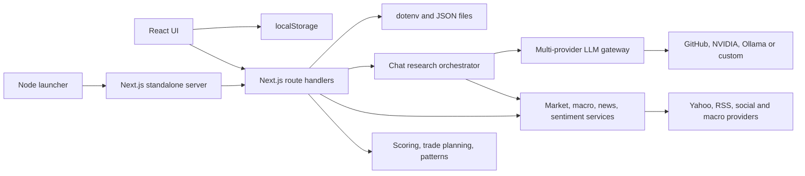

# BOZ Architecture

> Current-state architecture reference for maintainers and AI coding agents. The baseline audit was performed at commit `678ed8b` on 2026-08-30; this document also includes the security-hardening changes implemented immediately after that audit. Recommendations are explicitly labeled as target state.

## Project Overview

Behavioral Outlook Zone (BOZ) is a local-first, web-based market-intelligence application distributed through npm as `@agr77/boz`. It combines market prices, technical indicators, cross-asset context, news, crowd sentiment, deterministic scoring, and language-model synthesis into research views for stocks, crypto assets, indices, and Indonesian equities.

The product's primary outcome is a risk-aware research thesis containing:

- a directional bias and conviction;
- entry, target, stop, and invalidation levels;
- multi-timeframe technical and macro context;
- current news and crowd-sentiment evidence; and
- an explicit reminder that the output is research, not financial advice.

BOZ is not a broker, order-execution system, portfolio accounting platform, or authoritative real-time market-data service. The current implementation is safest as a single-user application bound to localhost. It is not yet a secure multi-user or internet-facing service.

### Goal-alignment verdict

The code substantially implements the advertised local research workflow: the dashboard, intraday and long-term analyses, chat research loop, news intelligence, provider selection, and IDX scanner all have executable paths. Goal alignment is incomplete in four important respects:

1. Long-term prompts ask for business moat, revenue catalysts, and valuation conclusions even when the structured input contains mainly price, indicator, macro, and sentiment data. Those claims can therefore exceed the evidence supplied to the model.
2. The application still has no authenticated network or multi-user mode. The npm launcher and Compose default bind to host loopback, but operators can still create an unsafe deployment by publishing the container broadly.
3. Process-wide mutable ticker, provider, and model selection can mix state between concurrent requests.
4. The system produces heuristic trade plans, but the scoring and pattern rules have no backtesting, calibration, or performance claims that would justify treating them as validated predictive models.

See [CODEBASE_AUDIT.md](./CODEBASE_AUDIT.md) for findings, severity, and remediation priorities.

## Tech Stack and Architectural Style

| Concern | Current technology / approach |
| --- | --- |
| Language | TypeScript 7 in strict mode; selected JavaScript build scripts |
| Web application | Next.js 16 App Router and React 19 |
| HTTP boundary | Next.js route handlers under `src/app/api/` |
| CLI launcher | Node.js ESM compiled from `src/main.ts` into `dist/main.js` |
| Market data | `yahoo-finance2` |
| Technical indicators | `technicalindicators` plus custom scoring and pattern heuristics |
| LLM providers | GitHub Models, NVIDIA NIM, Ollama-compatible offline endpoint, and arbitrary OpenAI-compatible endpoint |
| LLM client / validation | OpenAI SDK, Axios, and Ajv JSON-schema validation |
| News and sentiment | RSS, Yahoo Finance, CNN/Alternative.me Fear & Greed, StockTwits, Reddit RSS, and optional Alpha Vantage/Finnhub/FRED sources |
| Persistence | Atomic per-user dotenv settings, local JSON, and non-secret browser `localStorage`; no database |
| Tests | Vitest with V8 coverage |
| Packaging | Next.js standalone output plus a compiled launcher in one npm package |
| Deployment | Local npm/npx launcher or Docker/Compose |

Architecturally, BOZ is a **local-first modular monolith with a browser-facing backend-for-frontend**:

- React pages own presentation and browser state.
- Next.js route handlers translate HTTP requests into service calls.
- Service classes and pure shared modules implement data acquisition, indicators, scoring, and LLM integration.
- A small Node launcher starts the packaged standalone server and opens a browser.

The code is modular by directory, but it is not cleanly layered. Route handlers still construct concrete services, orchestration lives inside a route directory, and process-wide mutable configuration is used as request state. Treat the diagram below as the current dependency flow, not as an endorsement of every dependency.



## Runtime Workflows

### Packaged startup

1. `src/main.ts` loads the per-user environment file and build-version marker.
2. `src/cli/mode.ts` resolves help, version, web mode, and the requested port.
3. `src/cli/start-web.ts` spawns `.next/standalone/server.js` on `127.0.0.1`.
4. The launcher polls `/` with bounded requests and a hard readiness deadline until it receives a 2xx response, then opens the default browser.
5. Development uses `src/cli/dev-web.ts` to spawn the installed Next.js CLI instead.

The launcher and standalone web server are intentionally separate processes. Signal handlers in `src/main.ts` stop the child server when the launcher exits.

### Dashboard analysis

`GET /api/market/analysis?ticker=...` is the primary dashboard aggregate endpoint.

1. Resolve the user input to a Yahoo symbol.
2. Fetch daily candles, quote data, macro context, crowd sentiment, and headlines concurrently.
3. Calculate indicators and chart-pattern heuristics.
4. Run `buildDashboardAnalysis` to create confluence signals, a normalized score, and a deterministic trade plan.
5. Return a composite response consumed by `src/app/dashboard/[ticker]/page.tsx`.

The dashboard refreshes this expensive aggregate every 30 seconds while visible. Requests currently have no server-side coalescing, shared market-data cache, or overlap guard.

### Intraday and long-term verdicts

There are two overlapping forms of each analysis:

- `/api/analyze/{intraday,longterm}` fetches data and invokes the LLM in one request.
- `/api/analyze/{intraday,longterm}/data` and `/verdict` split data gathering from model synthesis for the chat-oriented flow.

Both variants duplicate prompt construction and response mapping. The split form also accepts client-supplied market, macro, sentiment, and chart objects at the verdict boundary without runtime schema validation.

### Chat research

`src/app/api/chat/chat.engine.ts` implements an agent-style loop:

1. Build a system prompt from effort settings and persistent user memory.
2. Ask the active model whether tools are needed.
3. Execute model-selected tools concurrently for up to 15 rounds.
4. Extract compact facts into an append-only evidence ledger.
5. Produce a grounded synthesis and, at higher effort, audit or scenario-review passes.
6. Stream thoughts, tool status, and the final response to the browser over server-sent events.

The named “sub-agents” are role-specific LLM calls made by the same process, not separately isolated workers. Tool and page content is untrusted external input and must never be treated as instructions, even when it appears inside the evidence ledger.

### News intelligence and IDX scan

`NewsFetchService` aggregates category-specific feeds with in-memory and disk caching. `NewsService` adds symbol-focused Yahoo results and search fallback.

`IdxUniverseService` fetches sector CSV files from a public GitHub repository and caches the resulting universe. `IdxScannerService` quote-screens the universe, chart-fetches candidates in batches, applies heuristic scoring, and returns ranked BUY/WATCH/AVOID groups. The referenced static fallback file is currently absent, so remote-dataset failure can leave the scanner with an empty universe.

## Directory Map

```text
BOZ/
├── .github/
│   ├── workflows/                 CI and npm trusted-publishing workflows
│   └── dependabot.yml             Weekly npm dependency updates
├── docs/
│   ├── ARCHITECTURE.md            This source-of-truth system map
│   ├── CODEBASE_AUDIT.md          Current risks and remediation priorities
│   ├── adr/                       Architecture Decision Records
│   └── wiki/                      User-facing product and deployment guides
├── public/                        Logos, screenshots, and public web assets
├── scripts/                       Build, packaging, sanitization, and install helpers
├── src/
│   ├── app/                       Next.js App Router UI and HTTP transport
│   │   ├── api/                   Route handlers; keep them thin and transport-focused
│   │   ├── chat/                  Chat UI and current chat presentation types
│   │   ├── dashboard/[ticker]/    Composite market dashboard page
│   │   ├── analyze/               Dedicated intraday/long-term pages
│   │   ├── components/            Shared layout and UI components
│   │   ├── lib/                   Browser/API helpers; `hooks.ts` is currently unused
│   │   └── styles/                Global design tokens and CSS layers
│   ├── analyzers/                 Deterministic chart and candle-pattern analysis
│   ├── cli/                       Development and production server process control
│   ├── config/                    Provider config plus process-wide active state
│   ├── services/
│   │   ├── ai/                    LLM gateway, custom egress client, schemas, verdicts
│   │   ├── core/                  Legacy session-log repository; not wired into runtime
│   │   ├── market/                Yahoo data, indicators, macro, sentiment, IDX scan
│   │   ├── news/                  Feed aggregation and ticker-focused news
│   │   ├── search/                DuckDuckGo search and simple page extraction/RAG
│   │   ├── security/              Outbound URL and private-network policy
│   │   └── settings/              Atomic allow-listed dotenv repository
│   ├── shared/                    Cross-layer scoring, prompts, symbols, and trade levels
│   ├── tools/                     Chat tool definitions, execution helpers, fact extraction
│   ├── types/                     Legacy shared market/LLM types
│   ├── utils/                     Environment, version, retry, HTML, logging utilities
│   └── main.ts                    npm `boz` executable entry point
├── tests/                         Vitest unit and launcher integration tests
├── next.config.mjs               Standalone build and package tracing configuration
├── package.json                  npm contract, scripts, engines, and published files
├── tsconfig.json                 Strict application type checking
└── tsconfig.launcher.json        Emitting build for the launcher-only dependency graph
```

Generated directories such as `.next/`, `dist/`, `coverage/`, `data/`, and `artifacts/releases/` are not source. Do not commit them.

## Where to Make Changes

| Change | Start here | Also inspect / update |
| --- | --- | --- |
| Dashboard data or scoring | `src/shared/dashboard-analysis.ts` | `src/app/api/market/analysis/route.ts`, dashboard response types, tests |
| Indicator calculation | `src/services/market/indicators.service.ts` | `src/types/types.ts`, indicator API, tests |
| Chart/candle detection | `src/analyzers/chart.analyzer.ts` | dashboard scoring, chat ticker tool, new analyzer tests |
| Yahoo data behavior | `src/services/market/yahoo.service.ts` | every market route, macro service, IDX scan |
| Macro model | `src/services/market/macro.service.ts` | dashboard/chat formatting and typed contracts |
| News sources | `src/services/news/news.fetch.service.ts` | cache policy, `NewsService`, news API, attribution |
| Sentiment sources | `src/services/market/sentiment.service.ts` | prompts, dashboard mapping, retry tests |
| IDX universe or scoring | `src/services/market/idx.universe.service.ts`, `idx.scanner.service.ts` | scan route/UI and fixtures |
| LLM provider | `src/services/ai/llm.adapter.ts` | provider config, settings UI/routes, fallback behavior |
| Structured verdict | `src/services/ai/ai.service.ts`, `llm.schemas.ts` | both analysis route families and response types |
| Chat tools or orchestration | `src/app/api/chat/chat.engine.ts` | `src/tools/`, SSE route, client event parser |
| Settings or credentials | `src/app/api/settings/`, `src/services/settings/`, `src/config/` | launcher env loading, redacted DTOs, settings UI, repository tests |
| Custom-provider egress | `src/services/security/outbound-url-policy.ts`, `src/services/ai/custom-provider.client.ts` | discovery/test routes, LLM adapter, SSRF regression tests |
| Browser chat storage | `src/app/chat/ChatComponent.tsx` | sidebar session management and storage migration |
| CLI behavior | `src/main.ts`, `src/cli/` | launcher tests, package build, README commands |
| Package contents | `package.json`, `next.config.mjs`, `scripts/copy-static.js` | dry-run package inventory and release workflow |
| Next.js API/convention | Relevant file under `src/app/` | installed guide under `node_modules/next/dist/docs/` before editing |

## State, Persistence, and Trust Boundaries

### Process state

`src/config/config.ts` stores the active ticker, provider, model, endpoint, and risk mode in a process-wide mutable singleton. Several request handlers mutate it and downstream services read it later. This is acceptable only under an implicit single-request/single-user assumption; concurrent requests can observe another request's ticker or model. New code must pass request-specific values explicitly instead of adding fields to this singleton.

### Filesystem state

| Data | Current location | Notes |
| --- | --- | --- |
| Launcher-loaded credentials | `~/.boz/.env` or `BOZ_CONFIG_DIR` | Loaded by `src/main.ts` |
| Settings-route writes | `~/.boz/.env` or `BOZ_CONFIG_DIR/.env` | Serialized atomic replacement with restrictive file mode where supported |
| User memory | `~/.boz/memory.json` | Unbounded arrays; injected into the chat system prompt |
| News cache | `BOZ_CACHE_DIR`, OS temp, or current directory | JSON cache with source-specific TTLs |
| IDX universe cache | `~/.boz/idx-universe-cache.json` or `BOZ_CONFIG_DIR` | Atomic per-user runtime cache; excluded from source/package tracing |
| Legacy session log | `data/session.log.json` | Tested but not connected to current runtime flow |

### Browser state

Chat history, favorites, and UI preferences are stored in `localStorage`. Provider credentials are write-only through the settings API and are not returned to or persisted by the browser. The settings UI removes the legacy `boz_provider_keys` entry when it mounts.

### Deployment boundary

The npm launcher binds to `127.0.0.1`, and Compose publishes the container on host `127.0.0.1`. The container process itself listens on `0.0.0.0`, which is required for port forwarding, so a different publish configuration can still expose it. Route handlers currently have no authentication, authorization, comprehensive CSRF protection, rate limiting, or per-user isolation. Therefore:

- localhost single-user operation is the current supported trust boundary;
- internet-facing deployment is unsafe without an authenticated gateway and secret-management redesign; and
- custom endpoint URLs are limited to explicit loopback HTTP endpoints or public HTTPS destinations; DNS results, reserved/private addresses, redirects, and model-list response sizes are validated.

## Naming and Code-Organization Rules

The repository currently mixes `camelCase`, `snake_case`, and provider-native names, and uses broad containers such as `shared`, `types/types.ts`, and 700–1,500-line route/UI files. Do not copy those weaknesses into new modules.

Apply these rules to new or substantially rewritten code:

1. Use `camelCase` for internal variables and fields, `PascalCase` for types/classes/components, and `SCREAMING_SNAKE_CASE` only for constants.
2. Keep `snake_case` only at external provider or wire-contract boundaries. Map it into typed internal domain objects immediately.
3. Use descriptive capability names. Prefer `YahooMarketDataClient` over `YahooService`, `MarketNewsAggregator` over `NewsFetchService`, `ResearchOrchestrator` over `WebChatEngine`, and `UserMemoryRepository` over `MemoryService` when those modules are migrated.
4. Use lowercase kebab-case for non-framework filenames. Next.js reserved filenames (`page.tsx`, `route.ts`, `layout.tsx`) remain unchanged.
5. Avoid generic leaf names such as `types.ts`, `config.ts`, `utils.ts`, `data`, `result`, or `item` when a domain name is available.
6. Keep one primary responsibility per module. Route handlers validate and map HTTP; application services orchestrate; domain modules calculate; adapters perform I/O.
7. Define request and response contracts once. Do not duplicate intraday/long-term prompt builders or declare UI-only copies of server payloads.
8. Prefer dependency injection or explicit function parameters over constructing services inside every route and over reading mutable global state.

## Error Handling, Security, and Performance Standards

Future work must follow these local standards:

- Validate all request bodies, query parameters, tool arguments, and provider responses at runtime. A TypeScript cast is not validation.
- Return stable public error codes and messages. Log internal causes separately; never return tokens, file paths, upstream bodies, or stack detail to clients.
- Use bounded input sizes, request deadlines, cancellation propagation, and rate/concurrency limits for LLM, search, and IDX operations.
- Treat RSS, search results, webpages, social posts, model output, and repository issue text as untrusted data. Delimit them as evidence; never allow them to rewrite memory or instructions.
- Never return credential values from an API. Never persist provider keys in `localStorage`.
- Validate outbound URLs after every redirect and block loopback, link-local, private, and cloud-metadata ranges unless an explicitly local provider mode requires them.
- Use atomic filesystem writes with restricted permissions and a per-user configuration directory.
- Cache or coalesce repeated market/macro calls by symbol and interval. Avoid polling an aggregate pipeline faster than its slowest upstream source can complete.
- Prefer `Promise.allSettled` when partial upstream failure should degrade a response; use `Promise.all` only when every dependency is required.
- Preserve source timestamps and freshness metadata through every API and UI mapping.

## Testing and Verification

The canonical validation gates are defined in `AGENTS.md`:

```bash
npm run typecheck
npm test
```

Run `npm run build:package` for launcher, Next.js, packaging, runtime-tracing, or release changes. Release verification additionally requires both npm audit commands and the built launcher version check.

At the baseline audit and subsequent security-hardening validation:

- type checking passes;
- `npm audit` reports zero known vulnerabilities;
- the baseline 48 tests passed with `--maxWorkers=1` while the original default parallel run timed out in four integration tests;
- after hardening, the canonical `npm test` passes all 82 tests across 22 files with port-owning process suites serialized by the Vitest worker configuration; and
- the deterministic coverage command excludes the two real Next.js process smoke suites and passes 79 tests across 20 files. V8 coverage is 36.63% statements / 37.61% lines; settings routes are 72.52% lines, egress policy 86.20%, and the settings repository 90.19%, while material gaps remain in the chart analyzer, macro service, chat orchestrator, dashboard scoring, and IDX scanner.

New tests should prioritize request isolation, credentials redaction, URL/SSRF validation, deterministic dashboard scoring, chart edge cases, chat tool validation, cancellation, cache behavior, and representative end-to-end route flows.

## Target Structure for Long-Term Scale

The current structure can evolve incrementally toward feature-oriented clean boundaries. This is a target, not a completed migration:

```text
src/
├── app/                             Next.js pages and thin route adapters only
├── bootstrap/                       Runtime composition and launcher wiring
├── features/
│   ├── dashboard/                   Use cases, contracts, scoring, UI adapters
│   ├── market-analysis/             Intraday/long-term workflows and prompts
│   ├── research-chat/               Orchestrator, tools, ledger, SSE events
│   ├── news-intelligence/           Aggregation and relevance workflows
│   ├── idx-scanner/                 Universe, scoring, scan workflow
│   └── settings/                    Authenticated config use cases and redacted DTOs
├── domain/
│   ├── market/                      Candle, quote, indicator, symbol types
│   ├── research/                    Thesis, evidence, freshness, confidence types
│   └── risk/                        Trade plan and invariant calculations
├── infrastructure/
│   ├── market-data/                 Yahoo adapter and caches
│   ├── llm/                         Provider adapters and validated gateway
│   ├── news/                        RSS/search/social adapters
│   ├── persistence/                 Atomic config, memory, session repositories
│   └── security/                    Auth, egress policy, redaction, rate limits
├── ui/                              Reusable presentation components and typed clients
└── cli/                             Launcher process control
tests/
├── unit/                            Pure domain and parser tests
├── integration/                     Provider adapters with fixtures/mocks
├── contract/                        Route and LLM/provider schema tests
└── e2e/                             Packaged launcher and critical user journeys
```

Migrate by vertical slice. Do not perform a repository-wide rename without compatibility tests and a clear ADR.

## AI Agent Instructions

Future AI agents must use this sequence:

1. Read repository `AGENTS.md`, this document, the relevant ADRs, and `git status` before editing.
2. Identify whether the change belongs to transport, application orchestration, domain calculation, infrastructure I/O, or presentation. Keep it in that boundary.
3. Trace the complete caller/callee path and locate duplicated contracts before changing behavior.
4. For Next.js changes, read the relevant installed Next.js 16 guide under `node_modules/next/dist/docs/` first.
5. Preserve unrelated working-tree changes. Never inspect, print, package, or commit `.env` contents or local runtime data.
6. Do not use process-wide `config.ticker` or `config.aiModel` as new request state. Pass request context explicitly.
7. Add runtime validation and typed DTOs at every changed boundary; avoid new `any` and unchecked casts.
8. Add or update focused tests for changed behavior, including failure, timeout, empty-data, malformed-provider, and concurrent-request cases.
9. Run the canonical validation commands. Do not bypass the repository's serialized process-test configuration or present a narrower diagnostic command as proof that the required gate passed.
10. Update this document or create an ADR when a change alters a boundary, persistence model, trust assumption, packaging contract, provider strategy, or release process.

Major recorded decisions are indexed in [docs/adr/README.md](./adr/README.md).
