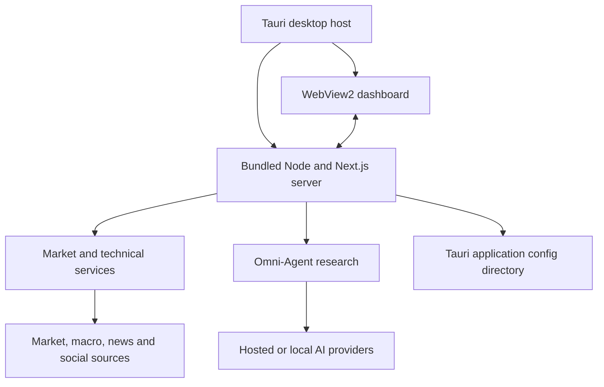

# Architecture & Core Engine

BOZ is a local-first Windows desktop application. A Tauri v2 Rust host uses the shared Windows WebView2 runtime for the Next.js 16 / React 19 interface and supervises a bundled Node.js 24.15.0 standalone server.

## System architecture

## Key architectural components

### 1. Tauri desktop lifecycle

- Enforces one instance and restores the existing window after a second launch.
- Owns the tray, opt-in autostart, signed updater, and external-link policy.
- Starts one sidecar on `127.0.0.1:21526`, validates its private health contract, and terminates its process tree on Quit or update.
- Grants the localhost dashboard no Tauri filesystem, shell, process, autostart, or updater commands.

### 2. Next.js standalone backend-for-frontend

- Preserves dynamic API routes and server-sent event chat streaming.
- Uses a sanitized architecture-native standalone build and native dependencies.
- Disables the unused in-memory route cache and startup entry preloading to reduce avoidable memory.

### 3. Asynchronous data and indicator pipeline

- Market quotes, candles, news, and sentiment are retrieved concurrently where partial failure is safe.
- External-provider outages degrade individual signals instead of crashing the complete analysis.
- Settings and server-side session context use the isolated desktop profile; WebView preferences remain in its own local storage.
